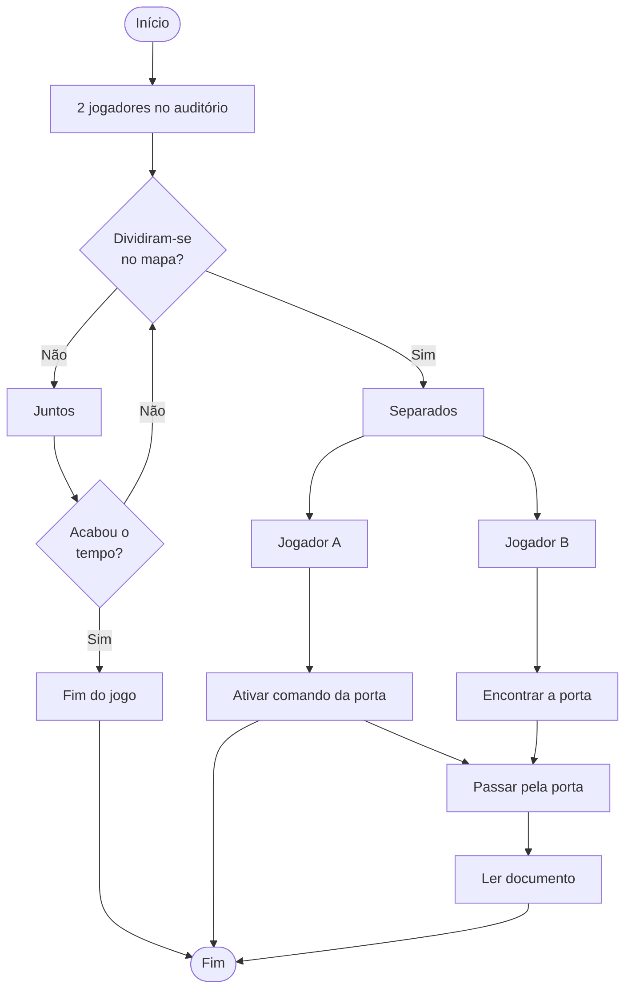
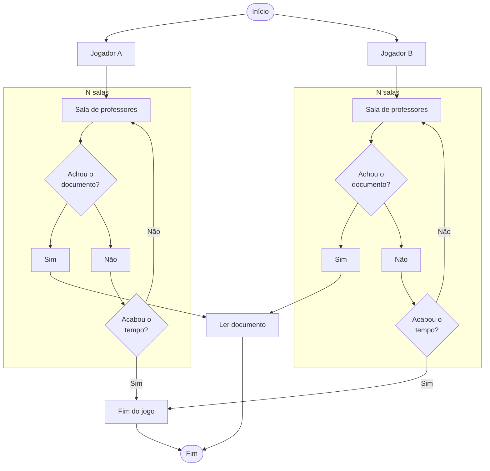
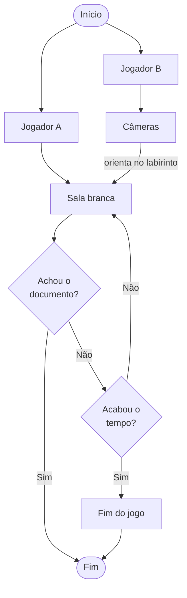
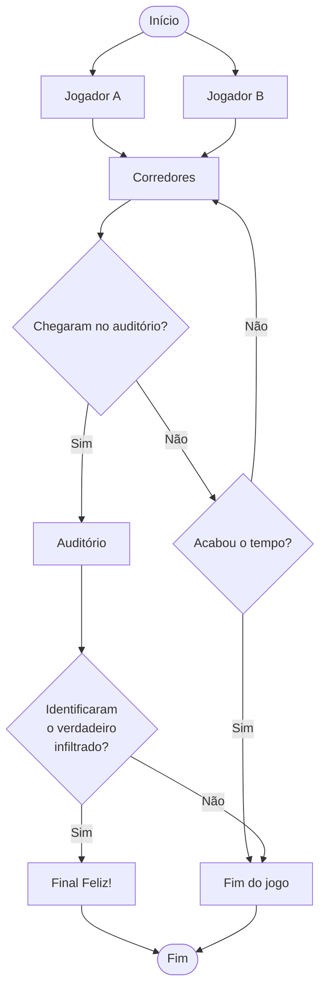

# ADC/IPT 2023.1

Para este semestre de 2023.1, a turma escolheu como tema de projeto o desenvolvimento de um jogo Web. Também a pedido, será desenvolvido um jogo modelo, de forma a auxiliar no processo.

## Premissa do jogo

2 alunos estão, enfim, formando-se no ensino médio. Porém, no dia da formatura, eles encontram uma nave espacial enterrada embaixo do auditório, onde ocorrerá a colação de grau, com planos de sequestrar os alunos (todos, será?) para um exoplaneta em _Alpha Centauri_ - mais especificamente de _Alpha Centauri C_ (_Proxima Centauri_). Eles têm pouco tempo para descobrir quem é o alienígena infiltrado no evento! Será um professor? Ou mesmo um de seus colegas?

## Ideia geral do jogo (ideal)

Eu sempre gostei de ficção científica. Quando eu era mais novo, no caso bem mais novo (eu nasci em 1980), eu nem conhecia o gênero pelo seu nome. Mas de [Planeta dos Macacos](https://www.imdb.com/title/tt0062711/) a [Barbarella](https://www.imdb.com/title/tt0062711/), [Spectreman](https://www.imdb.com/title/tt0262177/) a [O Fantático Jaspion](https://www.imdb.com/title/tt0262177/) (eu assistia a tudo na TV aberta), havia algo de incrível naqueles mundos estranhos e distantes. Eu fui abduzido para esse universo, e lá permaneci desde então.

O jogo aqui pensado é, na medida do possível, uma homenagem aos clássicos das revistinhas _pulp_, encontros insólitos entre bárbaros e macacos alienígenas, armas laser!, à fantasia absurda que entretém - e diverte. Sem _hard sci-fi_ dessa vez: o que interessa é o humor (ácido). Marte ataca!

Planeta: A Terra. Cidade: São José. Como em todas as metrópoles deste planeta, São José se acha hoje em desvantagem em sua luta contra o maior inimigo do homem: a poluição. Mas muitos outros planetas além do nosso sistema solar sofrem com o mesmo mal. Um em especial, que para nós terráqueos chama-se _Proxima Centauri c_, também está acometido pela poluição descontrolada dos rios e oceanos subterrâneos. No curto prazo, pouco pode ser feito. No médio prazo, porém, há uma chance, ainda que remota: o sequestro de cérebros de outros planetas para formar uma única Grande Mente para resolver o maior dos problemas dos habitantes do planeta _c_.

Várias missões espaciais foram destacadas para os vários quadrantes do espaço. E, no caso da Terra, uma foi designada para coletar os melhores espécimes para extração. Na chegada da nave à atmosfera terrestre, em 1989, o piloto achou por bem escondê-la em um prédio em construção. Mais especificamente, nas coordenadas terrestres 27°36'30.427"S e 48°38'0.938"O. Paciência, eles virão.

E eles vieram. Em 2023, vários humanos mostraram-se propensos a serem extraídos. E uma data foi marcada para facilitar o processo: o dia da formatura do ensino médio, quando todos estariam reunidos no auditório do câmpus e, maravilha!, logo acima da nave.

Entretanto, dois alunos chegaram mais cedo para o evento. Distraídos, vagaram pelos espaços do prédio, e encontraram uma passagem para a nave. Curiosos, inconsequentes, futuros heróis!, descobriram o plano de sequestro para o planeta _c_ e decidiram localizar o alienígena infiltrado na formatura antes que seja tarde demais. Mas quem será o impostor? Um professor? Um colega de classe? Não percam as aventuras de **Os Jovens Intrépidos contra os Centaurianos Devoradores de Mentes**!

## Regras do jogo

O jogo tem _n_ salas de partida. Cada sala possui o limite mínimo e máximo de 2 jogadores. Ao escolher uma sala, o jogo verifica se a sala está cheia, para somente assim iniciar a partida.

Ambos os jogadores têm canal de áudio ativado quando começa a partida, canal esse compartilhado com o outro jogador da sala.

Ambos os jogadores começam no centro do tabuleiro, que é maior que a tela. O tabuleiro está em plano cartesiano (2D) para movimentação dos personagens nos eixos X e Y. Cada jogador possui câmera própria, logo a apresentação do jogador será central na tela, com a movimentação do tabuleiro.

Na tela há controle de movimentação para cada eixo (vertical e horizontal). Para tornar a experiência do jogo mais interessante, a cada intervalo de tempo (decrescente no desenrolar de cada partida) a tela fica totalmente de uma única cor (um _flash_ de luz) e os controle são embaralhados para ambos os jogadores. Em termos de história, são raios de controle mental lançados pelo infiltrado para chamar os alunos para a nave, o que gera desorientação. Isso significa que, em cada um desse intervalos, os direcionais da tela têm operação diferente:

- Primeiro intervalo: direcionais de cada jogadores operando normalmente.
- Segundo intervalo: direcionais ficam invertidos (de "cabeça para baixo").
- Terceiro intervalo: direcionais controlam os jogadores remotos.
- Quarto intervalo: direcionais são combinados, onde os comandos controlam ambos os personagens.

Opcionalmente, camadas (_layers_) do tabuleiro (_tilemap_) podem ser alternadas, oferecendo obstáculos (_tiles_) distintos a cada intervalo de tempo.

A partida tem limite de tempo. Ambos os jogadores devem coletar objetos e resolver, com esses, quebra-cabeças dentro do prazo.

## Objetivo do jogo

O objetivo dos jogadores é, basicamente, identificar quem é o infiltrado na multidão que está dentro do auditório do câmpus. Se a escolha for a certa, ambos os jogadores ganham a partida. Caso contrário, uma nova partida é reiniciada, e são gerados novos valores (aleatórios) ao estilo _rogue-lite_ (algumas informações podem ser aproveitadas):

- Quem é o infiltrado;
- Onde estão os objetos para coletar;
- Disposição dos quebra-cabeças no tabuleiro.

## Fluxogramas dos quebra-cabeças

Quebra-cabeça 1: os dois jogadores estão na entrada do auditório, conversando. A cada intervalo de tempo, cerca de 1 minuto, há um forte _flash_ de luz, como um raio, e seus movimentos parecem erráticos. Algo, portanto, está errado. Decidem, então, procurar por alguma informação, e para isso precisam decidir se o fazem juntos ou separados. Separados, conseguirão achar um laboratório trancado, cuja porta só pode ser aberta a distância - com uma chave remota que está do outro lado do mapa, no claviculário do prédio. Dentro do laboratório, há um documento com o plano alienígena. Porém, se fizerem a busca juntos, não haverá como abrir a porta, e o jogo termina com a nave levando os cérebros dos alunos embora.

Quebra-cabeça 2: o documento é o plano alienígena para levar os cérebros dos formandos para o seu planeta natal. O dois jogadores precisam, então, descobrir quem é o infiltrado. Há várias salas de professores, e o melhor é dividirem para conquistar, até porque como passaram pelo quebra-cabeça 1, o intervalo de troca de direcionais diminui pela metade - a cada 30 segundos.

Quebra-cabeças 3: o segundo documento indica que nas salas de aula brancas contêm informações para descobrir a identidade do infiltrado. Porém, ao entrar na sala branca, os jogadores perceberão que tudo é branco: paredes, mobília etc. Exceto um item: a câmera de segurança. Ou seja, é preciso ir até a portaria (ou direção do câmpus ou mesmo a sala da TI) para olhar as câmeras para um jogador auxiliar a movimentação do outro. O ideal, aqui, é usar a imagem do jogador da sala branca como minimapa (_minimap_) para auxílio a distância. O intervalo de troca de direcionais decai pela metade: 15 segundo.

Quebra-cabeças 4: o intervalo de troca de direcionais cai para meros 5 segundos. Agora, é preciso correr para chegarem, juntos, até o auditório, e apontar quem é o infiltrado antes que o jogo termine (mal). Aqui, uma contagem regressiva aparece na tela: ambos têm de estar no auditório em 30 segundos!

## Possíveis formas de receita

Por se tratar de um jogo ao estilo _rogue-lite_, e o tempo ser um elemento importante no jogo, podem ser usados _elixires de velocidade_, que mudam a velocidade do relógio da partida (para mais ou menos). Assim, como possibilidade de receita uma loja virtual dentro do jogo:

- Roupas personalizadas;
- Elixires de velocidade;
- Dicas de localização dos objetos e solução dos quebra-cabeças.

## Referências

Inspirado no de mistério como [The Dig](<https://en.wikipedia.org/wiki/The_Dig_(video_game)>), no filme [O Enigma do Outro Mundo](https://www.imdb.com/title/tt0084787/) e em livros de detetive como Agatha Christie ([O Caso dos Dez Negrinhos](https://www.goodreads.com/book/show/26162628-o-caso-dos-dez-negrinhos) e [Assassinato no Expresso do Oriente](https://www.goodreads.com/book/show/23006548-assassinato-no-expresso-do-oriente)), a ideia é de um jogo de busca por pistas para solucionar o mistério. Os dois personagens, separados mas conectados por um canal de voz (com possíveis ruídos ao longo da jornada), devem vasculhar o prédio por objetos a coletar, informações a reunir e fazer as acusações (já jogou [Detetive](https://www.estrela.com.br/jogo-detetive-retro/p)?). Tudo isso regado ao ótimo _new age_ de [Vangelis](https://open.spotify.com/artist/4P70aqttdpJ9vuYFDmf7f6/discography/all) (destaque para [Albedo 0.39](https://open.spotify.com/album/7M2EhhKnJYcmluPNzmB35N) e [The Best of...](https://open.spotify.com/album/7y45PMMVyz4EGcfck4gyY7)).

Para o desenvolvimento de jogo Web em geral:

- [IFSC: jogos Web com Javascript](https://boidacarapreta.gitbook.io/projetos/integrado-ao-ensino-medio-em-telecomunicacoes/aplicacao-web-com-javascript)
- [IGF: finalistas](https://igf.com/finalists-and-winners)
- [Itch: top games made with Phaser](https://itch.io/games/made-with-phaser)
- [Indie Games Plus](https://indiegamesplus.com)

## Jogos e aplicativos do alunos

Projeto modelo: [adcipt20231](https://github.com/users/boidacarapreta/projects/4).

| Equipe                                              | Jogo                                                                                       | Projeto                                                                         | Entrega 1 | Entrega 2 |
| --------------------------------------------------- | ------------------------------------------------------------------------------------------ | ------------------------------------------------------------------------------- | --------- | --------- |
| [silentiummm](https://github.com/silentiummm)       | [Cattus](https://github.com/silentiummm/Cattus)                                            | [Cattus](https://github.com/orgs/silentiummm/projects/1)                        | 6         |           |
| [lotus gamess](https://github.com/lotus-gamess)     | [Em busca das flores mágicas](https://github.com/lotus-gamess/Em-busca-das-flores-magicas) | [Em busca das flores magicas](https://github.com/orgs/lotus-gamess/projects/2)  | 6         |           |
| [ifgamessc](https://github.com/ifgamessc)           | [Folclore](https://github.com/ifgamessc/Folclore)                                          | [Kanban](https://github.com/orgs/ifgamessc/projects/1)                          | 6         |           |
| [Lorum-Gaming](https://github.com/Lorum-Gaming)     | [God Between Us](https://github.com/Lorum-Gaming/God-Between-Us)                           | [Gods between Us](https://github.com/orgs/Lorum-Gaming/projects/1/views/1)      | 8         |           |
| [Hope-Games](https://github.com/Hope-Games)         | [The quest for knowledge](https://github.com/Hope-Games/jogo)                              | [Kanban](https://github.com/orgs/Hope-Games/projects/1)                         | 6         |           |
| [ja-on1](https://github.com/ja-on1/jogo1)           | [João & Maria: The order of warder](https://github.com/ja-on1/jogo1)                       | [Kanban](https://github.com/orgs/ja-on1/projects/1)                             | 6         |           |
| [AbleTecnologia](https://github.com/AbleTecnologia) | [jogoifsc](https://github.com/AbleTecnologia/jogoifsc)                                     | [Projeção de Tarefas](https://github.com/orgs/AbleTecnologia/projects/1)        | 6         |           |
| [BIGUA GAMES](https://github.com/BIGUA-GAMES)       | [Notte Eterna Z](https://github.com/BIGUA-GAMES/Notte-Eterna-Z)                            | [Notte Eterna Z](https://github.com/orgs/BIGUA-GAMES/projects/1)                | 6         |           |
| [leandrofars](https://github.com/leandrofars)       | [Oktopus](https://github.com/leandrofars/oktopus)                                          | [Open Source TR369 Controller](https://github.com/users/leandrofars/projects/1) | 6         |           |
| [Saga-games](https://github.com/Saga-games)         | [Trivert](https://github.com/Saga-games/Trivert)                                           | [Trivert](https://github.com/orgs/Saga-games/projects/1)                        | 6         |           |
| [Higor](https://github.com/Higorass)                | [Don't look](https://github.com/Higorass/Don-t-look/tree/main)                             | [Projeto](https://github.com/users/Higorass/projects/1)                         | 6         |           |

## Designer dos Jogos

Para os alunos no desenvolvimento artístico dos jogos, se tratando também da leitura inconciente dos jogadores.
Dados para informação:

- Os personagens, o recomendado é ser 64X64, caso outro personagem seja maior ou menor, que seja proporcional, exemplo : 32X32, 128x128.
- O tamanho da tela é 800x450

## Códigos para pesquisa 

- Sprite pixel art *TANANA*( TANANA coloca o que deseja, ex: base, princesa) de preferência em inglês

Os principais links para as artes :

- [Para remover o fundo](https://www.remove.bg/pt-br)
  *Tem como editar, caso alguma parte não apareça*
- [Para melhorar a qualidade dos desenhos](https://picwish.com/pt/photo-enhancer)
- [Para redimensionar as imagens](https://www.iloveimg.com/pt/redimensionar-imagem)
- [Pesquisas de sprites e geral](https://br.pinterest.com/)
- [Editores Gerais 1 ](https://picsart.com/pt)
- [Editores Gerais 2 ](https://www.canva.com/pt_br/)
- [Para construção Simples](https://www.piskelapp.com/)
- [Para construção Avançada](https://krita.org/en/)
- [Para músicas de fundo](https://www.salamisound.com/pt/jogo-sounds)
- [Para vídeos de construção de personagens](https://www.youtube.com/@AdamCYounis) 
- [Direção do caminhar dos personagens](https://www.youtube.com/watch?v=jUaytU-XJ-U)
- [Construção desde a origem](https://www.youtube.com/watch?v=Iv4ZgH0bbSY) 
- [Detalhes da construção](https://www.youtube.com/watch?v=6Vu5tylaw10)
- [Escala do personagem e cenário](https://www.youtube.com/watch?v=Gwrpw1YtuGo)
- [Construção dos cenários mais complexos](https://www.youtube.com/watch?v=tFApGVTFlLk)
- [Arquivo de 64BITS com 4 frames de movimento](https://pin.it/4VGgLHl)
- Arquivo com tamanho de tela do jogo [New Piskel](https://user-images.githubusercontent.com/102801474/228325517-ebe57908-6b34-49f3-930f-81f2874e6fe7.png)

OBS: Ao clicar no link, apertar botão direito em 'salvar como', depois executar no piskel

## Objetivos das semanas:

O objetivo semana 1 :

- Todas as referências, imagens de cenários, personagens, capas, objetivos do jogo e o desenvolvimento e percurso do jogo.

Objetivo semana 2 :
* Na terça feira, necessito que todos os itens do objetivo da semana 1, estejam concluídos  estarei ausente na segunda-feira) 

- Iniciar a construção de personagens e cenários, separando o catálogo de desenhos do jogos em :

- 1 Remover fundo e proporção
- 2 Recortar e colar (união das fotos) 
- 3 Construção de personagens 

Objetivo semana 3 :

- Com a base do portfólio 1 pronto
- E meio caminho e finalização do 2 

Objetivo semana 4 :
- 1 e 2 prontos
- Construção dos personagens 

Objetivo semana 5:
- Construção de personagens
- Inicialização de cenários 

Objetivo semana 6: 
- Evoluindo e construção de personagens 
- Construção de cenários meio para fim 
- Base das capas 

Objetivo semana 7: 
- Construção das capas 
- FInalização dos cenários 
- Finalização dos personagens 

Objetivos semana 8 :
- Capas, cenários e personagens prontos 

Objetivo semana 9 :
- Ajustes de movimentos (frames) 
- Ajustes dos itens gerais 
