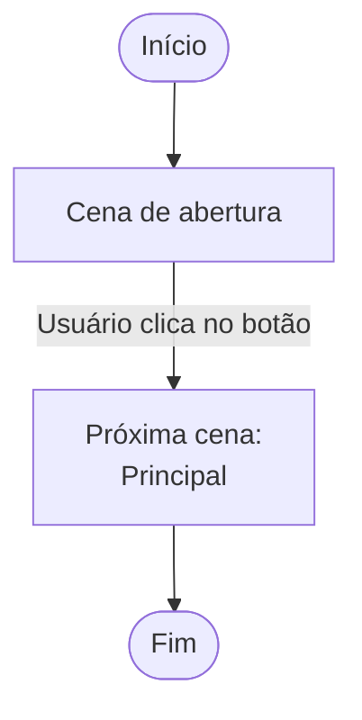
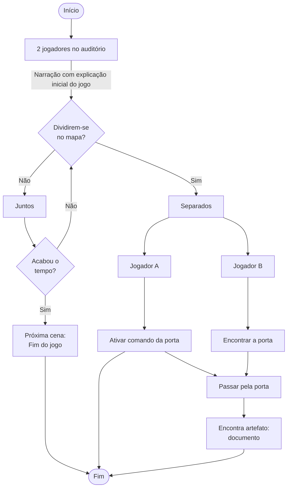
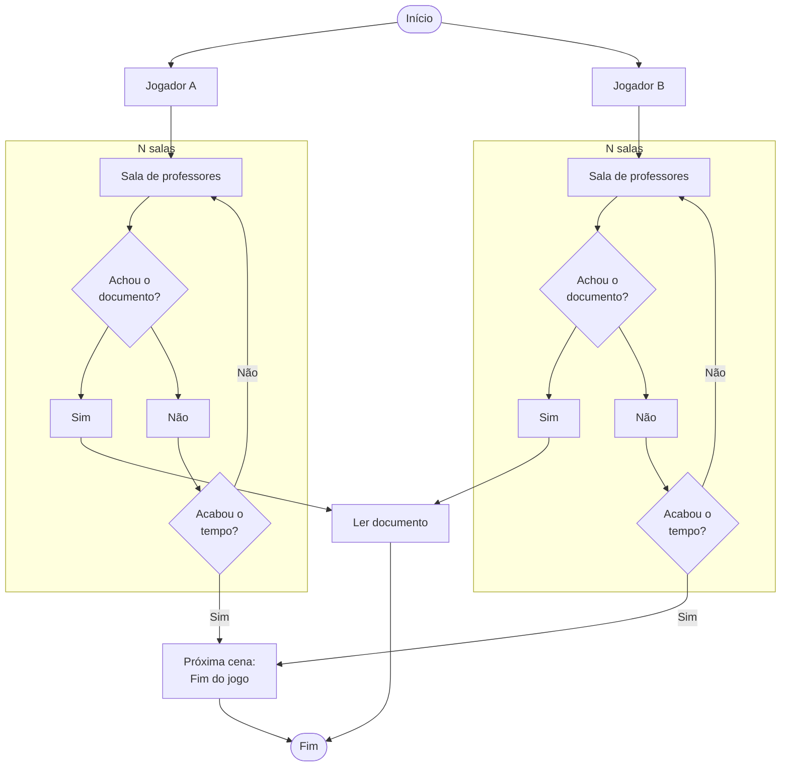
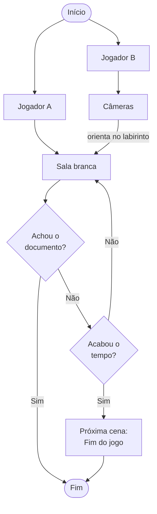
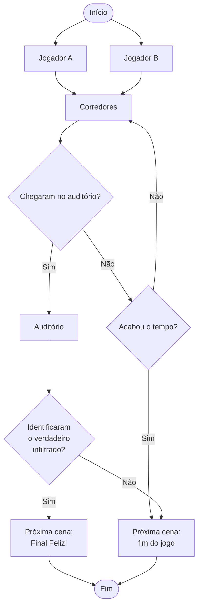
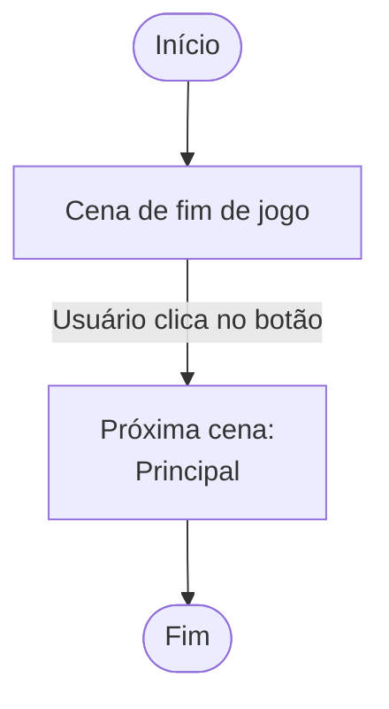
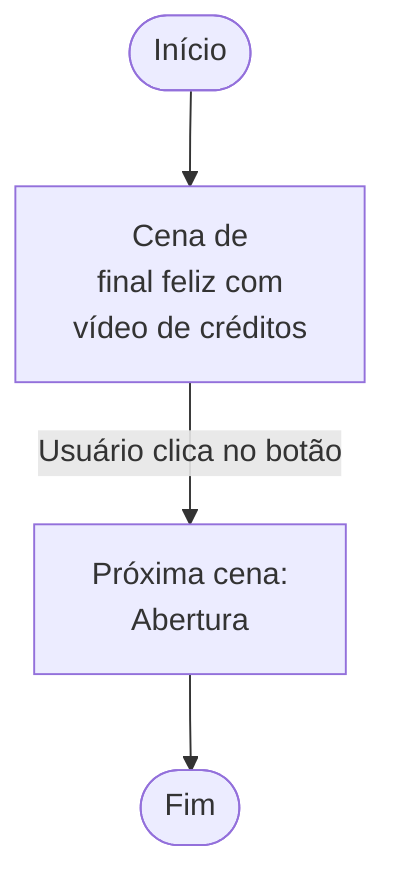

# Jogo modelo: fluxogramas

Organizado por cenas e seus quebra-cabeças.

## Cena de abertura

A cena de abertura é basicamente uma imagem de fundo com um botão para iniciar o jogo.

## Cena principal

A cena principal é dividida em quatro quebra-cabeças sequenciais.

Quebra-cabeça 1: os dois jogadores estão na entrada do auditório, conversando. A cada intervalo de tempo, cerca de 1 minuto, há um forte _flash_ de luz, como um raio, e seus movimentos parecem erráticos. Algo, portanto, está errado. Decidem, então, procurar por alguma informação, e para isso precisam decidir se o fazem juntos ou separados. Separados, conseguirão achar um laboratório trancado, cuja porta só pode ser aberta a distância - com uma chave remota que está do outro lado do mapa, no claviculário do prédio. Dentro do laboratório, há um documento com o plano alienígena. Porém, se fizerem a busca juntos, não haverá como abrir a porta, e o jogo termina com a nave levando os cérebros dos alunos embora.

Quebra-cabeça 2: o documento é o plano alienígena para levar os cérebros dos formandos para o seu planeta natal. O dois jogadores precisam, então, descobrir quem é o infiltrado. Há várias salas de professores, e o melhor é dividirem para conquistar, até porque como passaram pelo quebra-cabeça 1, o intervalo de troca de direcionais diminui pela metade - a cada 30 segundos.

Quebra-cabeças 3: o segundo documento indica que nas salas de aula brancas contêm informações para descobrir a identidade do infiltrado. Porém, ao entrar na sala branca, os jogadores perceberão que tudo é branco: paredes, mobília etc. Exceto um item: a câmera de segurança. Ou seja, é preciso ir até a portaria (ou direção do câmpus ou mesmo a sala da TI) para olhar as câmeras para um jogador auxiliar a movimentação do outro. O ideal, aqui, é usar a imagem do jogador da sala branca como minimapa (_minimap_) para auxílio a distância. O intervalo de troca de direcionais decai pela metade: 15 segundos.

Quebra-cabeças 4: o intervalo de troca de direcionais cai para meros 5 segundos. Agora, é preciso correr para chegarem, juntos, até o auditório, e apontar quem é o infiltrado antes que o jogo termine (mal). Aqui, uma contagem regressiva aparece na tela: ambos têm de estar no auditório em 30 segundos!

## Cena de fim de jogo

A cena de fim de jogo é uma imagem de fundo com um botão para retornar ao início da cena principal.

## Cena de final feliz

A cena de final feliz é um vídeo com os créditos e, ao após a sua exibição, aparece um botão para retornar ao início da cena de abertura.

