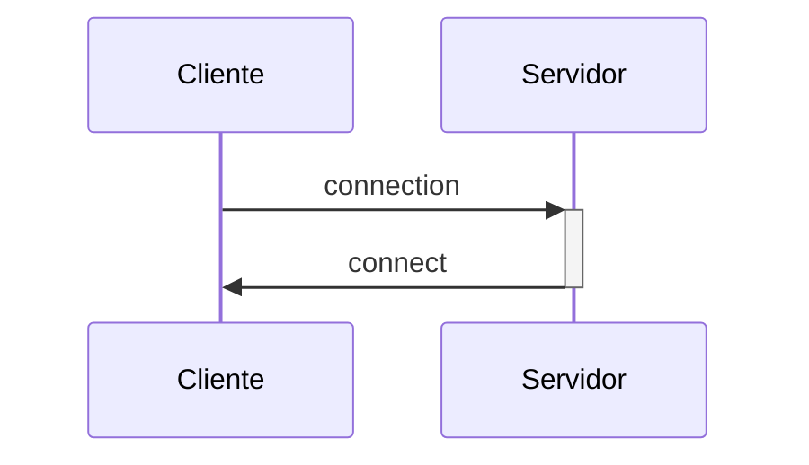
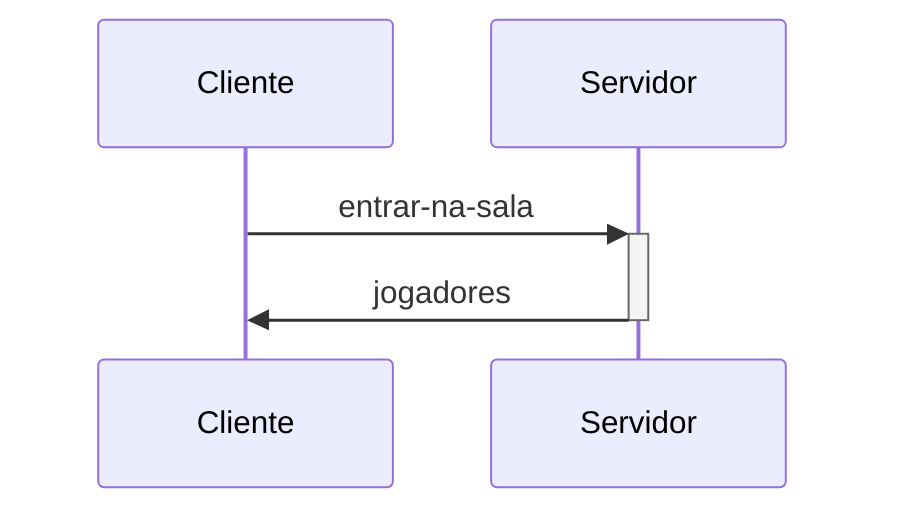
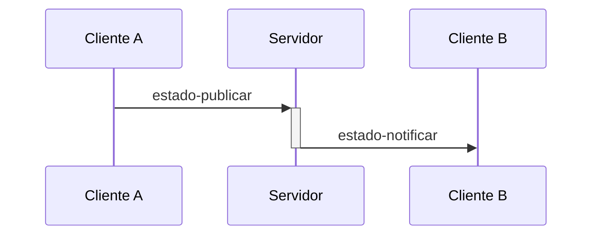

# Jogo modelo: trocas de mensagens trocadas entre cliente(s) e servidor

Para a funcionalidade multijogador (_multiplayer_), são usadas trocas de mensagens entre cliente(s) e servidor.

## Estabelecimento de conexão

O cliente estabelece conexão com o servidor.

## Entrada em sala

Antes de iniciar uma partida, o cliente escolhe uma sala para jogar. Como resposta, o servidor envia a lista de todos os jogadores presente nessa sala (incluindo o próprio cliente).

## Atualização de estado de jogador remoto

Como a partida tem pelo 2 - e apena 2 - jogadores, cada jogador envia regularmente o seu próprio estado para o servidor, que o encaminha para o outro jogador da partida. No fluxograma a seguir, é apresentada a atualização do jogador A para o jogador B.

## Atualização de estado de uso de artefatos

De forma equivalente ao caso anterior, toda ação sobre artefatos também é propagada de um cliente para outro, dado que a detecção de colisão é feita localmente (no navegador). No fluxograma a seguir, é apresentada a atualização do jogador A para o jogador B.

