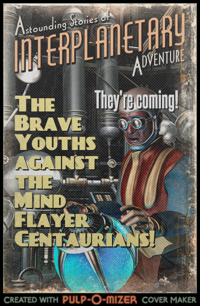

# Jogo modelo

Dois alunos estão, enfim, formando-se no ensino médio. Porém, no dia da formatura, eles encontram uma nave espacial enterrada embaixo do auditório, onde ocorrerá a colação de grau, com planos de sequestrar os alunos (todos, será?) para um exoplaneta em _Alpha Centauri_ - mais especificamente de _Alpha Centauri C_ (_Proxima Centauri_). Eles têm pouco tempo para descobrir quem é o alienígena infiltrado no evento! Será um professor? Ou mesmo um de seus colegas?

A ideia completa do jogo está disponível:

- [Descritivo do jogo (conceito, regras, objetivo etc.)](jogo-modelo-descritivo.md).
- [Trocas de mensagens entre o jogadores](jogo-modelo-mensagens.md).
- [Fluxogramas das cenas e quebra-cabeças](jogo-modelo-fluxogramas.md).
